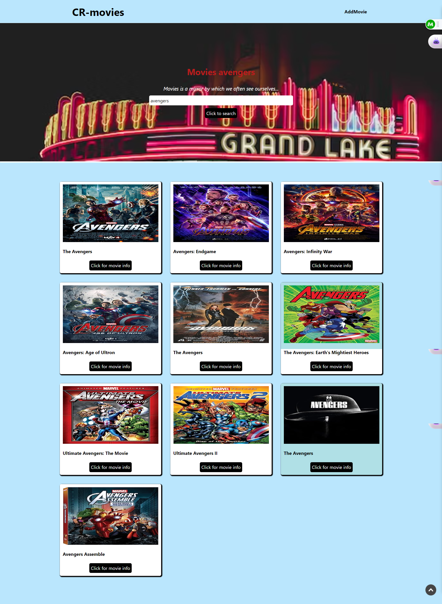

<div id="top"></div>
<div align="center">
    
</div>
<h1  align="center" > CrMovie Application</h1>
<!-- TABLE OF CONTENTS -->
<details>
  <summary>Table of Contents</summary>
  <ol>
    <li>
      <a href="#about-the-project">About The Project</a>
        <ul>
            <li><a href="#overview">Overview</a></li>
            <li><a href="#built-with">Built With</a></li>
            <li><a href="#contibuting">Contributing</a></li>
            <li><a href="#license"> License</a></li>
            <li><a href="#dependencies">Dependencies</a></li>
            <li><a href="#usage">Usage</a></li>
            <li><a href="#troubleshoot">Troubleshoot</a></li>
            <li><a href="#acknowledgement"> Acknowledgement</a></li>
        </ul>
    </li>      
  </ol>
</details>


## About The Project
Find your favorite movies effortlessly with our user-friendly application. We've curated a wide selection across genres and eras. Whether it's a thrilling mystery or a heartwarming romance, we've got you covered.

** Key features of this project include:**
```

Page Navigation - The ability to navigate between pages seamlessly.
Search Bar - A search bar that allows users to search for movies based on keywords or phrases.
Movie Details - A clickable button that provides users with additional details about the selected movie.
```
## Usage

Here is how to use this application:

1. Navigate to the homepage.
2. Use the search bar to find movies by title or genre.
3. Click on a movie to view its details.

<p align="right">(<a href="#top">back to top</a>)</p>

## Overview

* [Repo Codes]()

* [Hosted Link]()


<p align="right">(<a href="#top">back to top</a>)</p>

## Built With

### For the  Frontend

* [React](https://reactjs.org/)

* [Tailwind css](https://tailwindcss.com/)

* [vite](https://vitejs.dev/guide/#scaffolding-your-first-vite-project)

* [API](http://www.omdbapi.com)

### For the Backend

[MongoDB](https://www.mongodb.com/)


[Express](https://www.npmjs.com/package/express)


<p align="right">(<a href="#top">back to top</a>)</p>

## Contributing

We welcome contributions! If you'd like to contribute, please follow these steps:

1. Fork the repository.
2. Create a new branch for your feature (`git checkout -b feature/YourFeature`).
3. Commit your changes (`git commit -m 'Add some feature'`).
4. Push to the branch (`git push origin feature/YourFeature`).
5. Open a pull request.

## License

This project is licensed under the [MIT License](LICENSE).


<p align="right">(<a href="#top">back to top</a>)</p>


### Dependencies
[npm react-router-dom@6](https://reactrouter.com/docs/en/v6/getting-started/installation)

<p align="right">(<a href="#top">back to top</a>)</p>

## Troubleshoot

- Make sure you have installed the required dependencies by running `npm install`.
- Check that you have a stable internet connection.

<p align="right">(<a href="#top">back to top</a>)</p>


## Acknowledgement

- Thanks to the [OMDb API](http://www.omdbapi.com) for the movie data.

<p align="right">(<a href="#top">back to top</a>)</p>